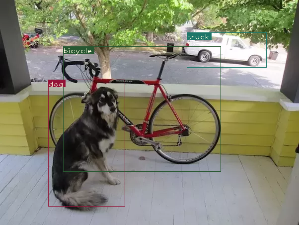

# yolov3-draft

yolov3的前向推理

## 结果



## 目录结构

- pallete - 颜色

## yolov3.cfg

```cfg
[convolutional] # conv + [bn] + [activation]
batch_normalize=1
filters=64
size=3
stride=2
pad=1
activation=leaky

[shortcut]
from=-3  # 前三层
activation=linear  

[upsample] # 双线性上采样
stride=2

[route] # 它将输出由该值索引的图层的特征图
layers = -4  #该层将从Route层向后从第4层输出特征图。

[route]
layers = -1, 61  # concatenated along the depth dimension. from -1 and 61 layer

[yolo]  # 输出
mask = 0,1,2
anchors = 10,13,  16,30,  33,23,  30,61,  62,45,  59,119,  116,90,  156,198,  373,326
classes=80
num=9
jitter=.3
ignore_thresh = .5
truth_thresh = 1
random=1

[net]  # 网络训练信息，在推理时不用
# Testing
batch=1
subdivisions=1
# Training
# batch=64
# subdivisions=16
width= 320
height = 320
channels=3
momentum=0.9
decay=0.0005
angle=0
saturation = 1.5
exposure = 1.5
hue=.1

```

## 输出处理

1. 过滤低于阈值的bbox的obj score
2. 使用nms过滤相邻的bbox

## yolo权重存储

权重只是存储为浮点数，没有任何东西可以指导我们它们属于哪一层。

权重仅属于两种类型的层，即批处理规范层或卷积层。

当batcn norm出现在convolutional块中时，就没有偏差。但是，当没有batch norm时，必须从文件中读取bias“权重”。

权重文件的前160个字节存储5个int32值，这些值构成文件的头。


## inference

https://blog.paperspace.com/how-to-implement-a-yolo-object-detector-in-pytorch/